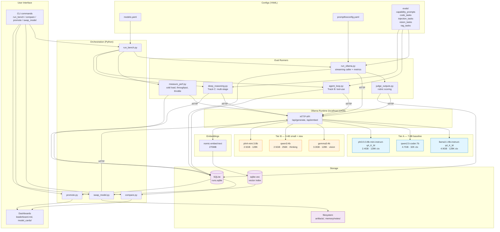
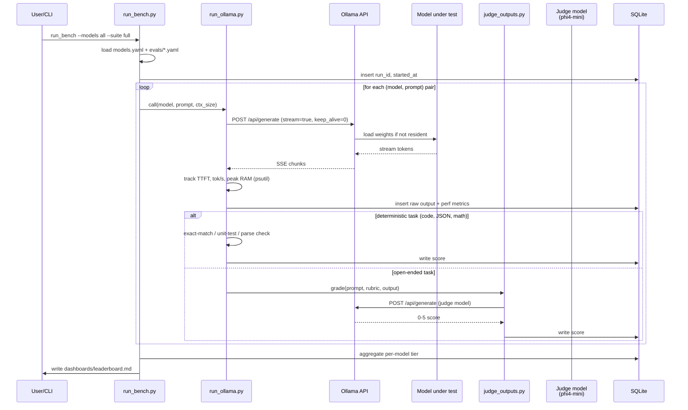
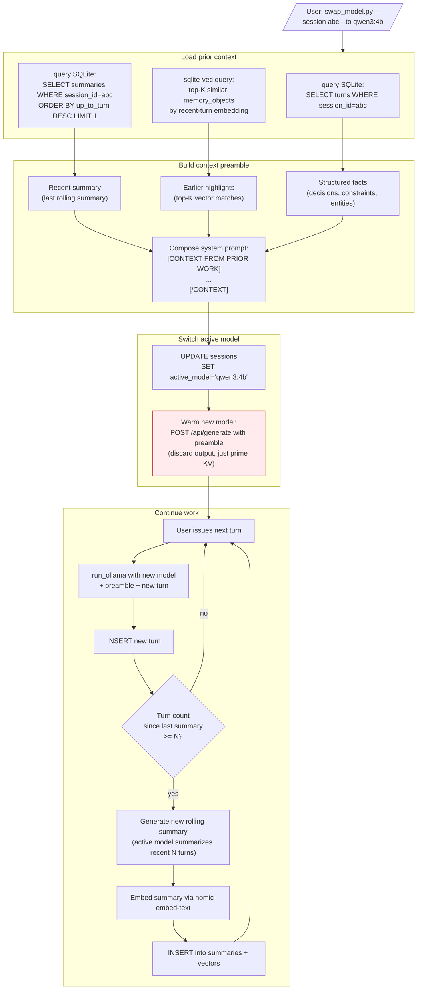

# local-model-bench — Architecture (engineering handoff)

Three diagrams, each targeting a different concern. Mermaid renders natively on GitHub, GitLab, VS Code (with extension), Notion, Obsidian, Mermaid Live Editor, etc.

---

## 1. System Architecture (component view)

The static picture: what exists, what owns what, who talks to whom.



### Key invariants for the engineer

- **Runners are stateless.** All state lives in SQLite + filesystem. Any runner can be killed and restarted; the harness picks up from the next un-run row.
- **Ollama is the only model boundary.** Swapping to MLX or llama.cpp later means changing one HTTP client, not the harness.
- **Configs drive everything.** Adding a model = one entry in `models.yaml`. Adding an eval = one YAML file under `evals/`. No code changes.
- **Two database concerns, one file.** `runs.sqlite` holds both eval results and memory-layer data. `sqlite-vec` is an extension loaded into the same DB, not a separate store.
- **`OLLAMA_KEEP_ALIVE=0` is required.** Without it, sequential model calls thrash memory because Ollama keeps the previous model resident for 5 minutes by default.

---

## 2. Single eval-run lifecycle (sequence)

What actually happens when you run `python run_bench.py --models all --suite full`. Engineers debugging "why did this score low" should follow this path.



### Key invariants

- **One row per inference.** Even within a multi-stage task (deep reasoning), each stage is its own row with a `parent_run_id`. This makes failure isolation possible.
- **Streaming is non-optional for metrics.** TTFT can only be measured if you read the response stream incrementally. Don't refactor `run_ollama.py` to use `stream=false`.
- **Judge calls are sequential, not parallel.** The judge model can be loaded simultaneously with small models (Phi-4-mini ~2.5GB) but conflicts with 8B models on this 16GB machine. Batch all 8B-under-test calls first, then run the judge pass.
- **Failures are logged, not raised.** A model crashing on prompt N must not abort prompts N+1..M. Wrap each call in try/except and write `score=null, error="..."` to the row.

---

## 3. Model-swap with memory retention

The differentiating capability: continue work on a project after switching models. This is also the part most likely to subtly break — engineers should pay attention to the embedding compatibility issue noted below.



### Key invariants and gotchas

- **Embedding model must be stable across swaps.** All vectors in `sqlite-vec` were generated with `nomic-embed-text`. If you swap the embedding model, you must re-embed all summaries — vectors from different embedding models are not comparable. This is the most common silent bug.
- **The new model never sees raw prior turns** — only the compressed preamble. This is intentional (cheaper, model-agnostic) but means the new model has no fine-grained recall. If you need it, query SQLite directly per turn.
- **Warm-up call is real, not cosmetic.** Models cold-start slow on M-series; the throwaway call gets the weights loaded and the KV cache primed before the user feels latency.
- **Summaries are lossy.** Don't depend on them for facts that need to survive verbatim — those go in `memory_objects` as structured records (decisions, constraints, entities). Two-track memory.
- **Session IDs are externally generated.** The harness doesn't auto-create sessions. Caller (CLI or wrapper script) supplies the ID.

---

## 4. SQLite schema (canonical)

The diagrams above reference these tables. Engineer should treat this as the source of truth.

```sql
-- Eval results
CREATE TABLE eval_runs (
  run_id TEXT,
  parent_run_id TEXT,           -- for multi-stage tasks
  timestamp TEXT,
  model TEXT,
  tier TEXT,
  domain TEXT,                   -- 'math', 'code', 'json', 'vision', etc.
  track TEXT,                    -- 'hitl', 'agent', 'deep_reasoning'
  prompt_id TEXT,
  ctx_size INTEGER,
  tokens_in INTEGER,
  tokens_out INTEGER,
  cold_load_ms INTEGER,
  ttft_ms INTEGER,
  latency_ms INTEGER,
  tok_per_sec REAL,
  peak_ram_mb INTEGER,
  output TEXT,                   -- raw model output
  score REAL,                    -- 0-1 normalized or 0-5 rubric/5
  scoring_method TEXT,           -- 'exact', 'unit_test', 'rubric', 'parse'
  judge_model TEXT,              -- if rubric
  error TEXT
);

-- Sustained throughput tests
CREATE TABLE perf_sustained (
  model TEXT,
  ts TEXT,
  run_index INTEGER,             -- 1..5
  tok_per_sec REAL,
  throttle_pct_vs_first REAL
);

-- Memory layer
CREATE TABLE sessions (
  session_id TEXT PRIMARY KEY,
  created_at TEXT,
  active_model TEXT
);

CREATE TABLE turns (
  turn_id INTEGER PRIMARY KEY AUTOINCREMENT,
  session_id TEXT,
  role TEXT,
  content TEXT,
  tokens INTEGER,
  ts TEXT
);

CREATE TABLE summaries (
  session_id TEXT,
  up_to_turn INTEGER,
  summary TEXT,
  embedding BLOB,
  ts TEXT
);

CREATE TABLE memory_objects (
  id TEXT PRIMARY KEY,
  type TEXT,                     -- 'decision' | 'fact' | 'constraint' | 'entity'
  session_id TEXT,
  date TEXT,
  project TEXT,
  summary TEXT,
  evidence_json TEXT,
  recheck TEXT,
  embedding BLOB
);

-- sqlite-vec virtual table (loaded via .load extension)
CREATE VIRTUAL TABLE vec_memory USING vec0(
  embedding float[768]           -- nomic-embed-text dimension
);
```

---

## 5. Where things plug in

For an engineer asked "where do I add X":

| Adding | Where it goes |
|---|---|
| New model | `models.yaml` only; no code change |
| New eval domain | `evals/<domain>.yaml` + scoring helper if non-standard |
| New scoring method | `runners/judge_outputs.py` — extend the `grade()` dispatcher |
| New track (4th mode) | New runner in `runners/`, register in `run_bench.py` |
| New backend (e.g. MLX) | `runners/run_ollama.py` becomes `run_backend.py` with a strategy interface; rest of stack unchanged |
| New dashboard view | `dashboards/` — read from SQLite, write markdown |
| New memory object type | `memory_objects.type` is already free-text; just start writing new types |

The boundary discipline is: **runners own model interaction, configs own what to test, SQLite owns everything else.**
